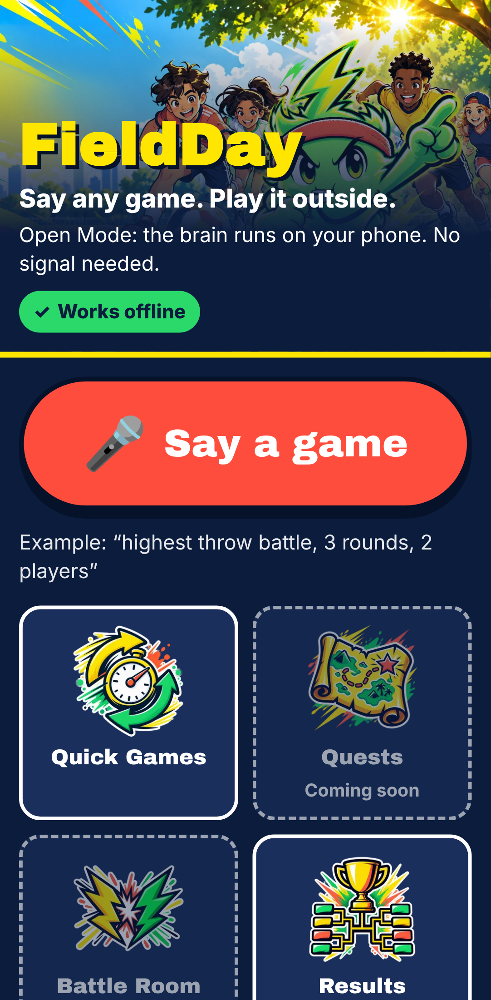

# FieldDay

> **Say any game. Play it outside. The phone is the referee.**

FieldDay turns a phone into a voice-first referee for real outdoor games, battles and shared quests.
You put the phone down and play with your body, a ball, or anything around you. The phone watches,
measures, keeps score, and shouts. The AI never writes code: it fills in a **Game Spec** (JSON made
from fixed building blocks), and a small, fully tested rules engine runs it.



## Status

| Phase | What | Status |
|---|---|---|
| 1 | Monorepo, PWA shell, schemas, rules engine, 12 templates, tests | ✅ done |
| 2 | Vision: pose, ball, audio onsets, calibration, Field Check | next |
| 3 | Gemma brain (Open Mode), Whisper, referee voice | |
| 4 | Battles on one phone | |
| 5 | Quests + QR ghosts (offline) | |
| 6 | Online multiplayer server | |
| 7 | OpenAI brain (Boost Mode) | |
| 8 | Polish + submissions | |

Right now the Play screen is a **test mode**: there is no camera yet, so you tap what happened
("Throw", "Catch", "Jump"…) and the phone keeps score, runs timers and referee calls, and speaks.

## Run it

Needs Node 22+ and pnpm 10.

```bash
pnpm install
pnpm dev            # web app on http://localhost:5173 (use the --host URL on your phone)
pnpm dev:server     # server on http://localhost:8787 (health check only for now)
pnpm test           # all unit tests (engine, quests, net, ui, vision, server, web)
pnpm typecheck
pnpm e2e            # Playwright smoke test (builds the PWA, checks offline reload)
pnpm assets         # re-make the small WebP images from /assets (needs ImageMagick)
```

Camera and mic need **HTTPS** on a real phone. For Phase 2 testing, use a tunnel or deploy the
built `apps/web/dist` to any static HTTPS host.

Build flag: `VITE_EDITION=devto` (default, Open Mode first) or `VITE_EDITION=hack47` (Auto mode
first). Same code; only the defaults and landing text change.

Server env vars: see `apps/server/.env.example`. The OpenAI key lives **only** on the server.

## Repo layout

```
apps/web         PWA (Vite + React + Zustand + Dexie)
apps/server      Hono server (rooms + OpenAI proxy in later phases)
packages/engine  Game Spec schema, condition language, rules engine, templates, game codes
packages/quests  Quest spec schema + quest runner
packages/net     zod schemas for client <-> server messages
packages/brain   Brain interface (Gemma / OpenAI come in Phases 3 and 7)
packages/vision  Camera/mic -> GameEvents (calibration so far)
packages/ui      Design tokens + shared components
fixtures/        Recorded-style event JSON used by tests
assets/          Original art; apps/web/public/img holds the small WebP copies
```

## Open Mode vs Boost Mode

| | Open Mode (default) | Boost Mode |
|---|---|---|
| Brain | Gemma, on the phone | OpenAI, through our server |
| Internet | Not needed | Needed (falls back to Open Mode) |
| Voice | Browser speech | Live Realtime voice |
| Photo checks | On-device object labels | Vision model |
| Cost | Free | API usage |

## Privacy

- **Video never leaves the phone.** Only small game events (`{player, event, measure, t}`) go over the network, and only in online multiplayer.
- Results, settings, games, quests and clips are stored on the phone (IndexedDB).
- Nothing is sent to OpenAI unless you turn on Boost Mode.
- Quests never use an exact location.

## Safety

Planned for Phase 3 and later: a safety check before every game or quest, Kids Mode, heat and
water reminders every 15 minutes, a clear-space check at setup, and friendly-only trash talk.

## Credits

Open-source libraries used so far:

| Library | Licence |
|---|---|
| [React](https://react.dev) | MIT |
| [Vite](https://vite.dev) + [@vitejs/plugin-react](https://github.com/vitejs/vite-plugin-react) | MIT |
| [vite-plugin-pwa](https://vite-pwa-org.netlify.app) / [Workbox](https://developer.chrome.com/docs/workbox) | MIT |
| [Zustand](https://github.com/pmndrs/zustand) | MIT |
| [Dexie.js](https://dexie.org) | Apache-2.0 |
| [Zod](https://zod.dev) | MIT |
| [Hono](https://hono.dev) + @hono/node-server | MIT |
| [TypeScript](https://www.typescriptlang.org) | Apache-2.0 |
| [Vitest](https://vitest.dev) | MIT |
| [Playwright](https://playwright.dev) | Apache-2.0 |
| [fake-indexeddb](https://github.com/dumbmatter/fakeIndexedDB) (tests) | Apache-2.0 |
| [tsx](https://github.com/privatenumber/tsx) | MIT |
| [Archivo Black](https://fonts.google.com/specimen/Archivo+Black) font via [Fontsource](https://fontsource.org) | OFL-1.1 (font), MIT (package) |

Models (MediaPipe, Gemma, Whisper) will be listed here when they are added.

Art in `/assets` (the mascot Volt, bosses, icons, badges) was made for this project with an image
model; the prompts are in `assets/manifest.json`.
