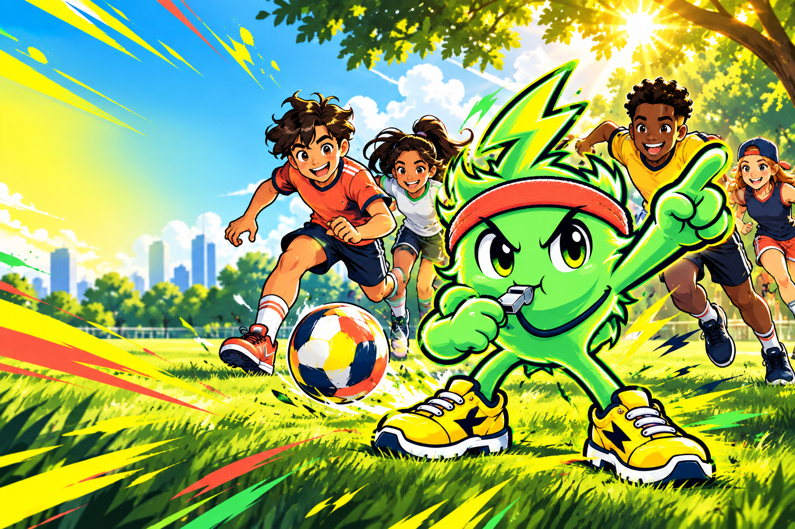

# FieldDay

> **Say any game. Play it outside. The phone is the referee.**



FieldDay turns a phone into a voice-first referee for real outdoor games, battles and quests.
Say a game ("highest throw battle, 3 rounds, 2 players"), lean the phone on a bag, and play with
your body and a ball. The phone watches (pose + ball tracking), listens (bounce and catch sounds),
measures (throw height, jump height, reaction time), keeps score, and shouts like a football
announcer, a wrestling host, a calm coach, a robot or a pirate.

The AI never writes code. It only fills in a **Game Spec**: JSON built from fixed blocks
(trackers, events, measures, rules). A small, fully tested rules engine runs the spec.

**Open Mode works with zero internet**: the brain (Gemma), speech to text (Whisper), body and ball
tracking (MediaPipe) all run on the phone.

## Two hackathons

- **DEV Hacktoberfest Week 1 ("Touch Grass")**: the git tag `v0.1-devto` is the submission. Open
  Mode only: Gemma (open-weight, on the phone) is the core; everything works offline.
- **Hack47 OFFGRID**: online multiplayer and Boost Mode (OpenAI) are added on top.

> **Commits after the `v0.1-devto` tag (October 2026) were made for Hack47 OFFGRID.**

## What you can do

- **Say a game** by voice (or type it). The brain designs it, checks it is safe and that the camera
  can referee it, and the referee reads the rules aloud.
- **12 quick games**: Sky Toss, Bounce & Catch, Keepy-Uppy, Target Toss, Long Throw, Jump Battle,
  Freeze Tag Statue, Reaction Race, Squat Storm, Mirror Me, Sprint & Tap, Boss Raid.
- **Camera referee** with a Field Check (steady phone, light, whole body, ball, free space) and
  per-player calibration (about ±10% accurate). Tap mode and a demo camera are always there too.
- **Battles on one phone**: Turn Battle, Side-by-Side Duel, Red vs Blue, Boss Raid (3 bosses),
  Chaos Mode, Rule Draft, King of the Hill, Tournament (up to 8), power-ups and a fair-play balancer.
- **Quests**: Daily Quest, Quest Builder by voice, relay quests, photo checks on the phone.
- **Ghost Challenges**: your scores in a QR code; a friend races your ghost, no internet needed.
- **Touch Grass**: Screen-Time Meter ("You played 34 minutes. Screen time: 4%"), Outside Score,
  streaks, XP and badges, water-break reminders every 15 minutes, highlight clips.

## Run it

Needs Node 22+ and pnpm 10.

```bash
pnpm install
pnpm dev            # web app on http://localhost:5173 (use the --host URL on your phone)
pnpm dev:server     # server on http://localhost:8787
pnpm test           # unit tests (engine, vision, brain, quests, net, ui, server, web)
pnpm typecheck
pnpm e2e            # Playwright: builds the PWA and plays games end to end, offline too
pnpm assets         # re-make the WebP images from /assets (needs ImageMagick)
pnpm --filter @fieldday/vision fixtures   # re-make the synthetic vision fixtures
```

Camera and mic need **HTTPS** on a real phone: deploy `apps/web/dist` to any static HTTPS host,
or use a tunnel to `pnpm preview`.

Build flag: `VITE_EDITION=devto` (default: Open Mode first) or `VITE_EDITION=hack47` (Auto mode
first). Same code; only the defaults and landing text change.

### Getting ready for offline

Open **Settings → Offline pack → Get ready for offline** once on Wi-Fi. It caches the camera
models (MediaPipe pose + object detector) and the speech model (Whisper tiny, about 40 MB).
After that, airplane mode is fine.

### Loading the Gemma model (Open Mode brain)

Gemma runs in the browser with MediaPipe LLM Inference, which needs **WebGPU** (recent Chrome on
Android/desktop). The model is large and gated (you accept the Gemma licence on Hugging Face), so
you bring it once:

1. On Hugging Face, accept the Gemma licence and download a MediaPipe web build, for example from
   `litert-community` (Gemma 3 1B IT, int4, `-web.task`) or the Gemma 3n / Gemma 4 `-web` builds
   listed in the MediaPipe LLM Inference docs.
2. In FieldDay: **Settings → Gemma model → Pick a Gemma .task file** (or paste a download link
   that needs no login). It is saved in the browser's private storage (OPFS).
3. Tap **Load Gemma**. Games are now designed on the phone.

Without the model (or without WebGPU), Open Mode still works: an offline rules designer turns your
words into a game from the templates, and the same safety check runs.

### Server

`apps/server` (Hono). Env vars are in `apps/server/.env.example`:
`PORT`, `ALLOWED_ORIGINS`, and for Boost Mode `OPENAI_API_KEY`, `OPENAI_DESIGN_MODEL`,
`OPENAI_VISION_MODEL`, `OPENAI_REALTIME_MODEL`. The OpenAI key never goes to the browser.

## Open Mode vs Boost Mode

| | Open Mode (default) | Boost Mode |
|---|---|---|
| Brain | Gemma on the phone (or offline rules) | OpenAI through the FieldDay server |
| Internet | Not needed | Needed; falls back to Open Mode |
| Speech to text | Whisper tiny on the phone | Whisper tiny on the phone |
| Referee voice | Browser speech + hand-written line banks | Live Realtime voice |
| Photo checks | On-device object labels + colours | Vision model |
| Cost | Free | API usage |

## Privacy

- **Video never leaves the phone.** Frames only go to the on-device models. Highlight clips are
  saved on the phone; you choose if you share them.
- Recorded test data ("Record test data" in Field Check) holds body points and ball boxes only.
- Results, settings, quests, ghosts and clips are stored on the phone (IndexedDB).
- Online multiplayer sends only small game events (`{player, event, measure, t}`).
- Boost Mode sends your game request text, quest photos (for the check) and referee moments to
  OpenAI through the server. Nothing goes to OpenAI in Open Mode.
- Quests never use an exact location, addresses or a map of other players.

## Safety

- A safety check runs before every game and quest, in every mode: no throwing at people, animals,
  cars or windows; no roads, water, climbing, heights, fire, sharp things, contact or strangers.
  Unsafe ideas get a kind refusal and a safer version.
- A feasibility check explains what the camera cannot do (spin, heart rate, long runs…) and offers
  the nearest game.
- Kids Mode: calm coach voice, no trash talk, longer timers.
- Water and shade reminder every 15 minutes; free-space reminder at the start of every game.
- Referee lines are hand-written and reviewed; any generated line passes a friendly-words filter.

## Repo layout

```
apps/web         PWA (Vite + React + Zustand + Dexie)
apps/server      Hono server
packages/engine  Game Spec schema, condition language, rules engine, templates, formats, ghosts
packages/vision  Pose/ball/audio detectors, identity, field check, simulator, fixtures format
packages/brain   Design pipeline, Gemma brain, offline rules, safety, referee lines, router
packages/quests  Quest spec, runner, generator (Daily Quest), share codes
packages/net     zod schemas for client <-> server messages
packages/ui      Design tokens + shared components
fixtures/        Engine event fixtures and vision frame fixtures used by tests
docs/            Screenshots, write-up notes
```

## Credits

Open-source libraries:

| Library | Licence |
|---|---|
| [React](https://react.dev) | MIT |
| [Vite](https://vite.dev) + [@vitejs/plugin-react](https://github.com/vitejs/vite-plugin-react) | MIT |
| [vite-plugin-pwa](https://vite-pwa-org.netlify.app) / [Workbox](https://developer.chrome.com/docs/workbox) | MIT |
| [Zustand](https://github.com/pmndrs/zustand) | MIT |
| [Dexie.js](https://dexie.org) | Apache-2.0 |
| [Zod](https://zod.dev) | MIT |
| [MediaPipe Tasks Vision](https://www.npmjs.com/package/@mediapipe/tasks-vision) | Apache-2.0 |
| [MediaPipe Tasks GenAI (LLM Inference)](https://www.npmjs.com/package/@mediapipe/tasks-genai) | Apache-2.0 |
| [Transformers.js](https://github.com/huggingface/transformers.js) | Apache-2.0 |
| [ONNX Runtime Web](https://onnxruntime.ai) | MIT |
| [fflate](https://github.com/101arrowz/fflate) | MIT |
| [qrcode](https://github.com/soldair/node-qrcode) | MIT |
| [jsQR](https://github.com/cozmo/jsQR) | Apache-2.0 |
| [Hono](https://hono.dev) + @hono/node-server | MIT |
| [TypeScript](https://www.typescriptlang.org) | Apache-2.0 |
| [Vitest](https://vitest.dev) | MIT |
| [Playwright](https://playwright.dev) | Apache-2.0 |
| [fake-indexeddb](https://github.com/dumbmatter/fakeIndexedDB) (tests) | Apache-2.0 |
| [tsx](https://github.com/privatenumber/tsx) | MIT |
| [Archivo Black](https://fonts.google.com/specimen/Archivo+Black) via [Fontsource](https://fontsource.org) | OFL-1.1 (font), MIT (package) |

Models:

| Model | Used for | Licence |
|---|---|---|
| [Gemma](https://ai.google.dev/gemma) (MediaPipe web build, brought by the user) | Open Mode brain | [Gemma Terms of Use](https://ai.google.dev/gemma/terms) |
| MediaPipe Pose Landmarker Lite | Body tracking | Apache-2.0 |
| MediaPipe EfficientDet-Lite0 (COCO) | Ball and object detection | Apache-2.0 |
| [Whisper tiny.en](https://github.com/openai/whisper) (`Xenova/whisper-tiny.en` ONNX) | Speech to text | MIT |

Art in `/assets` (the mascot Volt, bosses, icons, badges) was made for this project with an image
model; the prompts are in `assets/manifest.json`.
