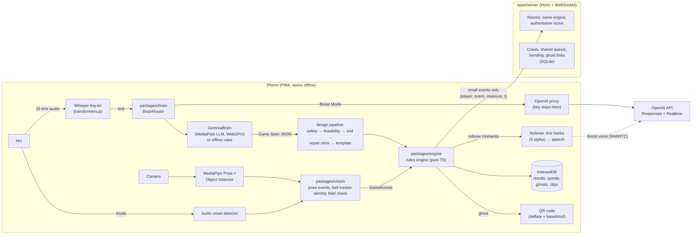

# FieldDay architecture

## Key ideas

- **The AI never writes code.** Both brains only fill in a Game Spec made of fixed blocks
  (trackers, events, measures, rules). `packages/engine` validates it with zod and runs it.
- **Conditions are data**, not code: `"height_m >= 2"`, `"before ball_release"`, `"is call"`.
- **The engine is pure** (no DOM, no clock): events in with timestamps, referee moments out.
  The same engine runs on the phone and on the server, so online scores match.
- **Vision is tested on fixtures**: recorded/simulated frames → events → engine → winner.
- **Two brains, one pipeline**: Gemma (on device) and OpenAI (through the server) both go
  through safety → feasibility → validation → one repair → template fallback.
- **Video never leaves the phone.** Only small game events go to the server.

## Packages

| Package | What | Tests |
|---|---|---|
| `engine` | Game Spec schema, condition language, rules engine, 12 templates, battle formats, power-ups, ghosts | fixtures for all 12 templates, formats, power-ups |
| `vision` | Pose events, ball tracker (parabola fit), audio onsets, fusion, identity, colour tracker, field check, simulator | simulated people with known sizes; 3 frame fixtures replayed into the engine |
| `brain` | Design pipeline, GemmaBrain, OpenAIBrain, offline rules, safety, feasibility, referee lines, photo judge, router, stats | fake LLM runners, router fallback |
| `quests` | Quest spec, runner, generator (Daily Quest), share codes | |
| `net` | Message schemas, anti-cheat, rate limiter, clock sync | |
| `ui` | Design tokens + components | contrast tests |
| `apps/server` | Rooms, crews, shared quests, trending, ghosts, OpenAI proxy | fake phones + real WebSocket + fake OpenAI |
| `apps/web` | The PWA | Playwright: every phase's "done when", offline, accessibility |
